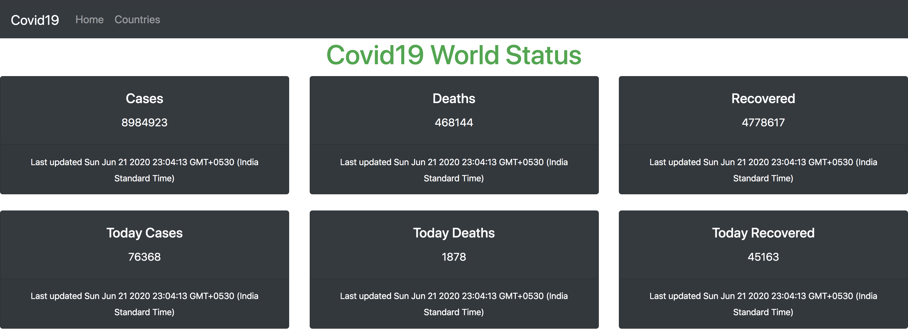
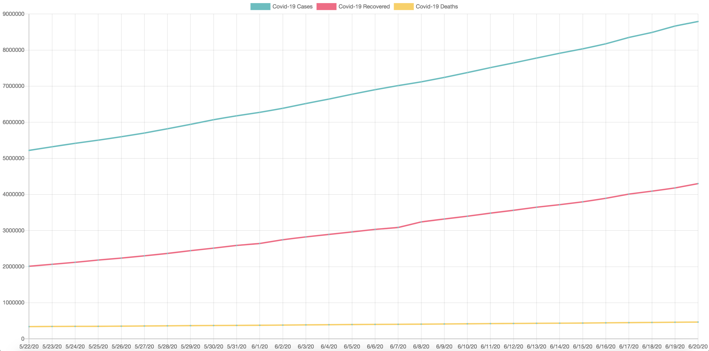
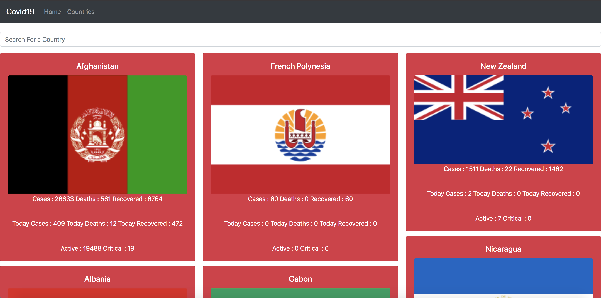

<b>Covid19 World Status</b>

This is a Application to view the Covid19 Status in World Wide.

After Cloning the project please execute th below command.

### `npm start`

Runs the app in the development mode. 
Open [http://localhost:3000](http://localhost:3000) to view it in the browser.

The page will reload if you make edits. 
You will also see any lint errors in the console.

- Navigate to /home(http://localhost:3000/home) to get the overall numerical picture.
   

   
   

   

   
   

- Navigate to /countries(http://localhost:3000/countries) to view the information for a specific country.
   

   
   

Please refer this <a href="https://corona.lmao.ninja/"> API </a> to get more numerical information about Covid19