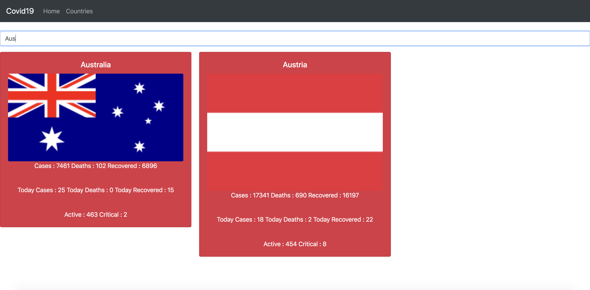

<b>Covid19 World Status</b>

This is a Application to view the Covid19 Status in World Wide.

After Cloning the project please execute the below command.

### `npm start`

Runs the app in the development mode. 
Open [http://localhost:3000](http://localhost:3000) to view it in the browser.

- Navigate to /home(http://localhost:3000/home) to get the overall numerical picture.
   

   
   

   

   
   

- Navigate to /countries(http://localhost:3000/countries) to view the information for a specific country.
   

   
   

   

   
   

Please refer  <a href="https://corona.lmao.ninja/"> Novel COVID API </a> to get more numerical information about Covid19